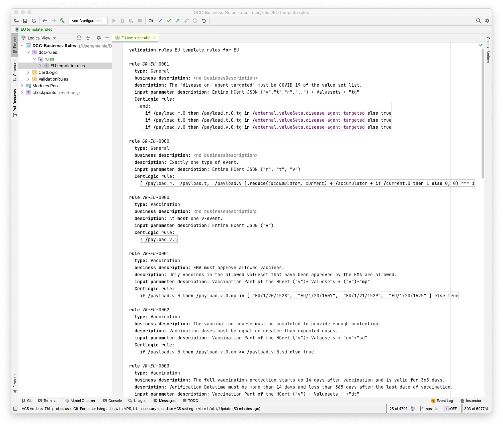

<h1 align="center">
 Digital COVID Certificates: MPS implementation of CertLogic
</h1>

    <a href="#about">About</a> •
    <a href="#organisation">Organisation</a> •
    <a href="#testing--status">Testing & Status</a> •
    <a href="#licensing">Licensing</a>

## About

This part of the repository contains implementations of CertLogic and Validation Rules languages in JetBrains MPS.
This validation rules environment is for demo-purposes only, for the moment.
(These implementations are not as feature-complete as they could be.)

## Installation

Steps:

1. [Download the latest version of MPS.](https://www.jetbrains.com/mps/download/)
2. Install it.
3. Open MPS, and point it to the [`DCC` directory](./DCC) which is an MPS project.
4. In the project overview:
   * navigate to the **dcc-rules** “solution” (marked with an “S” icon),
   * then to the **rules** “model” (marked with an "M" icon), 
   * and then double-click the **EU template rules** section.

Things should now look like this: 

## Testing & Status

- If you found any problems, please create an [Issue](/../../issues).
- Current status: Work-In-Progress.

## Licensing

Copyright (c) 2021 Dutch Ministry of Health, Welfare and Sport, and all other contributors

Licensed under the **Apache License, Version 2.0** (the "License"); you may not use this file except in compliance with the License.

You may obtain a copy of the License at https://www.apache.org/licenses/LICENSE-2.0.

Unless required by applicable law or agreed to in writing, software distributed under the License is distributed on an "AS IS"
BASIS, WITHOUT WARRANTIES OR CONDITIONS OF ANY KIND, either express or implied. See the [LICENSE](./LICENSE) for the specific
language governing permissions and limitations under the License.

